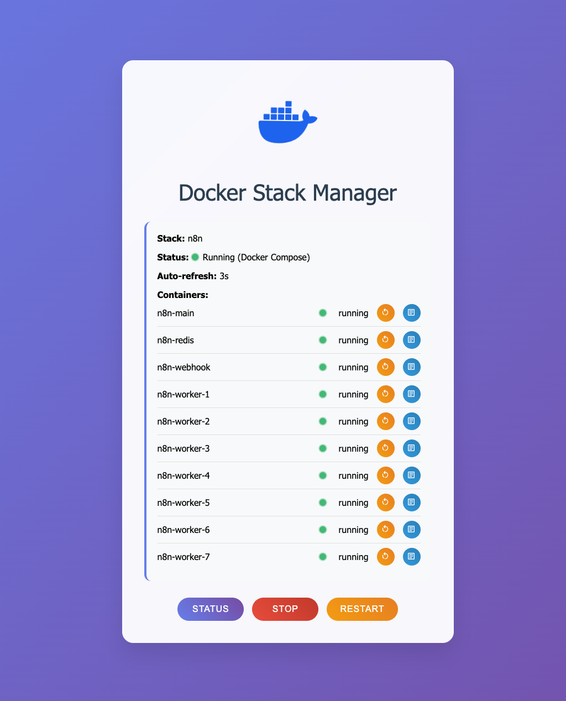

# Docker Stack Manager

A beautiful, responsive web interface for managing Docker stacks through Portainer's API. Monitor, control, and view logs for your Docker containers with an intuitive dashboard.




## ✨ Features

### 🐳 Stack Management
- **Single Stack View**: Monitor and control individual Docker stacks
- **All Stacks View**: Overview of all your Docker stacks at once (set `STACK_NAME=ALL`)
- **Real-time Status**: Auto-refresh every 30 seconds with countdown timer
- **Stack Actions**: Start, stop, and restart entire stacks with confirmation dialogs

### 📊 Container Monitoring
- **Live Status Indicators**: Animated green dots for running containers
- **Container Actions**: Individual restart and log viewing for each container
- **Smart UI**: Buttons only available for running containers
- **Stack Type Support**: Works with both Docker Compose and Docker Swarm stacks

### 📋 Advanced Logging
- **Real-time Log Viewing**: Modal-based log viewer with syntax highlighting
- **Auto-refresh Logs**: Toggle automatic log refreshing every 2 seconds
- **Customizable Lines**: Adjust log line count (10-1000 lines)
- **Auto-scroll**: Automatic scrolling to latest log entries
- **Dark Theme**: Easy-to-read logs with dark background

### 🎨 Modern Interface
- **Responsive Design**: Works perfectly on desktop, tablet, and mobile
- **Toast Notifications**: Non-intrusive success and error messages
- **Smooth Animations**: Floating Docker icon and animated status indicators
- **Custom Modals**: Beautiful confirmation dialogs and log viewers
- **Toggle Switches**: Modern toggle controls for settings

### 🔒 Security Features
- **IP Access Control**: Restrict access to specific IP addresses or CIDR ranges
- **Environment-based Config**: Secure configuration through `.env` file
- **No-index Headers**: Prevents search engine indexing

## 🚀 Quick Start

### Prerequisites
- Docker with Portainer installed
- Web server with PHP support
- Portainer API access token

### Installation

1. **Clone the repository**
   ```bash
   git clone https://github.com/Baanaaana/docker-stack-manager.git
   cd docker-stack-manager
   ```

2. **Configure environment**
   ```bash
   cp env.example .env
   ```

3. **Edit `.env` file**
   ```env
   # Portainer connection
   PORTAINER_URL=https://your-portainer-url.com
   PORTAINER_TOKEN=your_portainer_api_token
   
   # Stack to manage (or "ALL" for all stacks)
   STACK_NAME=your-stack-name
   
   # Security (optional)
   ALLOWED_IPS=192.168.1.100,10.0.0.0/8
   ```

4. **Deploy to web server**
   - Upload files to your web server
   - Ensure PHP has access to read the `.env` file
   - Access via your web browser

## ⚙️ Configuration

### Environment Variables

| Variable | Description | Example | Required |
|----------|-------------|---------|----------|
| `PORTAINER_URL` | Your Portainer instance URL | `https://portainer.example.com` | ✅ |
| `PORTAINER_TOKEN` | Portainer API access token | `ptr_xxxxxxxxxxxx` | ✅ |
| `STACK_NAME` | Stack name to manage or "ALL" | `my-app` or `ALL` | ✅ |
| `ALLOWED_IPS` | Comma-separated IPs/CIDR ranges | `192.168.1.0/24,10.0.0.1` | ❌ |

### Getting Portainer API Token

1. Open Portainer web interface
2. Go to **Settings** → **Users**
3. Click on your user
4. Go to **Access tokens** tab
5. Click **Add access token**
6. Copy the generated token

### Stack Name Options

- **Specific Stack**: Use exact stack name (case-sensitive)
  ```env
  STACK_NAME=my-application
  ```

- **All Stacks**: View and manage all stacks
  ```env
  STACK_NAME=ALL
  ```

## 📱 Usage

### Main Dashboard
- **Status Button**: Manually refresh stack status
- **Auto-refresh**: Shows countdown timer (30s intervals)
- **Stack Info**: Displays stack name, status, and type
- **Container List**: Shows all containers with status indicators

### Container Actions
- **🔄 Restart**: Restart individual containers (orange button)
- **📋 Logs**: View container logs in modal (blue button)
- **Status Dots**: Green blinking = running, Red = stopped

### Log Viewer
- **Auto-refresh Toggle**: Enable/disable 2-second log updates
- **Auto-scroll Toggle**: Automatically scroll to newest logs
- **Lines Setting**: Adjust number of log lines (10-1000)
- **Manual Refresh**: Force refresh logs immediately

### Stack Management
- **Start Stack**: Start all services in the stack
- **Stop Stack**: Stop all services in the stack  
- **Restart Stack**: Stop then start the entire stack

## 🎨 Interface Features

### Animations & Effects
- **Floating Docker Icon**: Gentle water-like animation (click to refresh page)
- **Blinking Status Dots**: Animated indicators for running containers
- **Hover Effects**: Interactive buttons and toggles
- **Smooth Transitions**: All UI elements have smooth animations

### Responsive Design
- **Mobile Optimized**: Works on phones, tablets, and desktops
- **Touch Friendly**: Large buttons and touch targets
- **Adaptive Layout**: Content adjusts to screen size

### Accessibility
- **Tooltips**: Helpful hover hints for all actions
- **Confirmation Dialogs**: Prevents accidental actions
- **Keyboard Support**: ESC key closes modals
- **Screen Reader Friendly**: Semantic HTML structure

## 🔧 Technical Details

### Requirements
- **PHP**: 7.0 or higher
- **Web Server**: Apache, Nginx, or similar
- **Browser**: Modern browser with JavaScript enabled
- **Portainer**: Compatible with Portainer CE/EE

### API Compatibility
- Portainer API v2.x
- Docker Engine API
- Docker Compose stacks
- Docker Swarm stacks

### File Structure
```
docker-stack-manager/
├── index.php          # Main application file
├── .env               # Configuration (create from env.example)
├── env.example        # Environment template
├── favicon.svg        # App icon
└── README.md         # This file
```

## 🛡️ Security

### Access Control
Configure IP restrictions in `.env`:
```env
# Single IP
ALLOWED_IPS=192.168.1.100

# Multiple IPs
ALLOWED_IPS=192.168.1.100,10.0.0.50

# CIDR ranges
ALLOWED_IPS=192.168.1.0/24,10.0.0.0/8

# Mixed
ALLOWED_IPS=192.168.1.100,10.0.0.0/8,172.16.0.0/12
```

### Best Practices
- Use HTTPS for Portainer connection
- Restrict access with `ALLOWED_IPS`
- Use read-only Portainer tokens when possible
- Deploy behind reverse proxy with authentication
- Regularly rotate API tokens

## 🤝 Contributing

Contributions are welcome! Please feel free to submit a Pull Request.

### Development Setup
1. Fork the repository
2. Create a feature branch
3. Make your changes
4. Test thoroughly
5. Submit a pull request

## 📄 License

This project is open source and available under the [MIT License](LICENSE).

## 🐛 Issues & Support

If you encounter any issues or have questions:

1. Check existing [GitHub Issues](https://github.com/Baanaaana/docker-stack-manager/issues)
2. Create a new issue with detailed information
3. Include your environment details and error messages

## 🙏 Acknowledgments

- Built with [Material Design Icons](https://materialdesignicons.com/)
- Powered by [Portainer API](https://docs.portainer.io/api/docs)
- Inspired by modern container management needs

---

<div align="center">
  <strong>Made with ❤️ for the Docker community</strong>
</div>